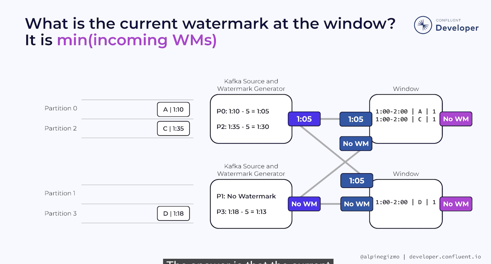

The challenge: a table has a timestamp column doesn't necessarily imply that those timestamps are advancing

Why isn't my Flink job producing any results? 99% cases due to something wrong with the watermarking
- tips for debugging: switch to use processing time
- idle stream problem: streams do not advance the watermark. It prevents windows from producing results
- Solutions
  - Configure to use idleness detection
    - e.g. `set 'table.exec.source.idle-timeout' = '2000';`
  - Send keep-alive events (???)
  - Ensure no empty or idle by balance the partitions
    - e.g.　'sink.partitioner' = 'fixed' 会导致所有数据写入同一个partition (partition 0 in general), 如果有一个kafka source有3个partition，剩下的两个就是idle partition，从而holdback watermark (No watermark)
# watermark
an assertion about the completeness of the stream
- Batch processing does not need a mechanism like watermark because of not having out‑of‑order issue
- Watermark = `max_timestamp` - `out_of_orderness` - 1ms 
  - No Watermark: watermark set to `-2^63`
- Watermark 的本质是event time的进度指示器（像blockchain的lastest block，但是没有count，只看 timeout）
- The operator’s global watermark = the minimum of all subtasks’ watermarks.
  - Event‑time windows cannot close until all partitions’ watermarks advance past the window boundary.

In Flink, event‑time windows close only when the operator’s watermark advances past the window end.
- watermark 随时间增加，直到watermark开始超过window end时间，自此window关闭
  - 告诉 Flink watermark之前的数据已经到齐(finality), 可以安全地关闭窗口，触发时间相关计算
- watermark之后的event被视为late
  - Flink SQL drop late events
  - DataStream API have more late events control

## `max_timestamp`
largest event time (timestamp) seen so far
- aka. max event time | 当前已看到的最大事件时间字段当中的最大的值

## `out_of_orderness`
lateness, 乱序容忍
- default to 0
- It is an estimation
- provides control over the tradeoff between completeness and latency